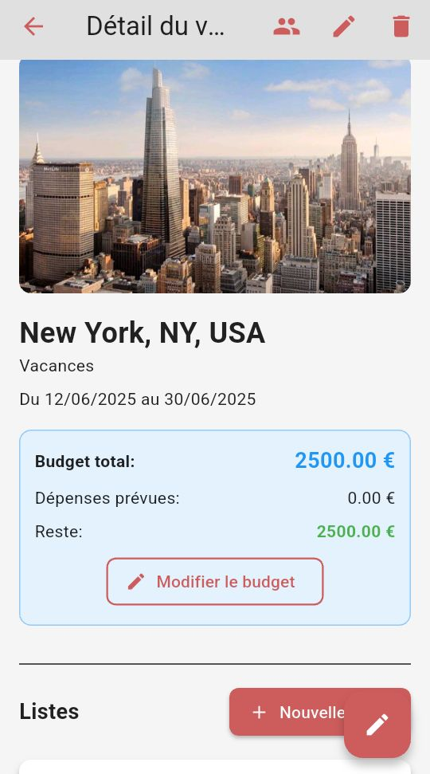
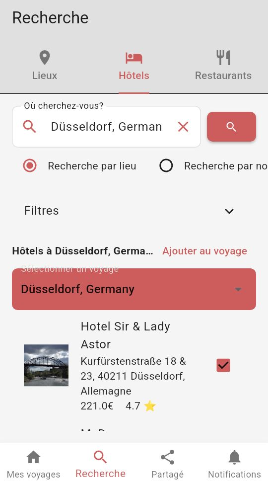

<!-- ═══ PAGE HERO ═══ -->

  
Tout en détail

  <h1>Fonctionnalités <em style="font-style:italic; color:var(--gold);">complètes</em></h1>
  
Chaque fonctionnalité d'Ifenia a été pensée pour sublimer l'expérience voyage.

<!-- ═══ CONTENU ═══ -->
<section class="section section--navy">
  

    <!-- Gestion des voyages -->
    

      

        ✈️
        <h2>Gestion des voyages</h2>
      

      <ul class="feature-list">
        <li>Création avec autocomplétion Google Places (destination)</li>
        <li>Catégorie, dates de début et de fin, budget, devise</li>
        <li>Image de couverture personnalisée</li>
        <li>Suggestions d'activités Google Places → ajout automatique</li>
        <li>3 listes pré-créées : Indispensables · À faire avant de partir · À visiter</li>
        <li>Édition complète de tous les champs, suppression du voyage</li>
        <li>Badge statut : Personnel / Partagé / Collaborateur</li>
        <li>Séparation voyages actifs / archivés (date passée)</li>
        <li>Invitation par QR code ou code textuel 8 caractères</li>
        <li>Rejoindre un voyage via code depuis l'écran principal</li>
      </ul>
    

    <!-- 7 Onglets -->
    

      

        📋
        <h2>7 Onglets par voyage</h2>
      

      

        

          ✅
          Listes
        

        

          🗺️
          Roadbook
        

        

          ⛅
          Météo
        

        

          💬
          Messages
        

        

          💳
          Dépenses
        

        

          📸
          Photos
        

        

          🗳️
          Votes
        

      

      <ul class="feature-list">
        <li><strong>Listes</strong> — Checklists personnalisées, items avec titre, coché, budget, date</li>
        <li><strong>Roadbook</strong> — Itinéraire unifié trié par jour/heure, créneaux typés</li>
        <li><strong>Météo</strong> — Open-Meteo, quotidien, emoji WMO, 16 jours à l'avance</li>
        <li><strong>Messages</strong> — Chat temps réel entre collaborateurs via Firestore</li>
        <li><strong>Dépenses</strong> — Partagées, répartition configurable, soldes automatiques</li>
        <li><strong>Photos</strong> — Album collaboratif, grille 3 colonnes, upload compressé</li>
        <li><strong>Votes</strong> — Sondages temps réel, 2–4 options, barres de progression live</li>
      </ul>
    

    <!-- Carte Google Maps -->
    

      

        📍
        <h2>Carte interactive</h2>
      

      <ul class="feature-list">
        <li>Vue plein écran depuis le Roadbook</li>
        <li>Marqueur principal sur la destination du voyage</li>
        <li>Marqueurs colorés par type de créneau (visite, restaurant, hôtel, transport, activité)</li>
        <li>Géocodage automatique via Google Geocoding API</li>
        <li>InfoWindow au tap : titre + description du créneau</li>
      </ul>
    

    <!-- Collaboration -->
    

      

        👥
        <h2>Collaboration</h2>
      

      <ul class="feature-list">
        <li>Ajout de collaborateurs par email avec autocomplétion (8 résultats)</li>
        <li>Rôles distincts : owner et editor</li>
        <li>Suppression de collaborateur par le propriétaire</li>
        <li>Invitation par QR code généré ou code 8 caractères</li>
        <li>Notification automatique lors d'une modification de liste</li>
        <li>Badge temps réel Notifications (non-lues)</li>
      </ul>
    

    <!-- Notifications push -->
    

      

        🔔
        <h2>Notifications push (FCM)</h2>
      

      <ul class="feature-list">
        <li>Token FCM stocké dans Firestore users/{uid}.fcmToken</li>
        <li>Notifications foreground via flutter_local_notifications</li>
        <li>Navigation au tap vers le voyage concerné</li>
        <li>Cloud Function déclenchée à la création d'une notification</li>
        <li>4 préférences granulaires : activité collaborateurs, invitations, rappels, changements majeurs</li>
      </ul>
    

    <!-- Export PDF -->
    

      

        📄
        <h2>Export PDF</h2>
      

      <ul class="feature-list">
        <li>Page de couverture avec image du voyage</li>
        <li>Informations générales et liste des collaborateurs</li>
        <li>Itinéraire jour par jour (Roadbook)</li>
        <li>Checklists complètes (items cochés et non cochés)</li>
        <li>Récapitulatif des dépenses et soldes par personne</li>
        <li>Partage natif via impression ou envoi (share_plus)</li>
      </ul>
    

    <!-- Exploration -->
    

      

        🔍
        <h2>Exploration (Search)</h2>
      

      <ul class="feature-list">
        <li>3 onglets : Lieux &amp; Attractions · Hôtels · Restaurants</li>
        <li>Recherche via Google Places API (top 10 résultats)</li>
        <li>Affichage : photo, nom, adresse, rating, type de cuisine</li>
        <li>Navigation vers Google Maps depuis les résultats</li>
      </ul>
    

    <!-- Communauté -->
    

      

        🌍
        <h2>Listes communautaires</h2>
      

      <ul class="feature-list">
        <li>Partager une liste d'un voyage vers la communauté</li>
        <li>Découvrir : récentes / populaires / favoris</li>
        <li>Like / Unlike en temps réel</li>
        <li>Signaler une liste inappropriée</li>
        <li>Importer une liste communautaire dans un voyage</li>
      </ul>
    

    <!-- Paramètres -->
    

      

        ⚙️
        <h2>Paramètres &amp; Thèmes</h2>
      

      <ul class="feature-list">
        <li>7 thèmes de couleur : Navy · Red · Dark Green · Brown · Mustard · Salmon · Dark</li>
        <li>Thème "Dark" → mode sombre automatique</li>
        <li>Langue : Français / Anglais (mémorisé)</li>
        <li>Notifications globales on/off</li>
        <li>Profil utilisateur : nom, bio, téléphone, photo</li>
        <li>Fonctionnement hors-ligne (Firestore persistance illimitée)</li>
      </ul>
    

    <!-- Stack technique -->
    

      

        🛠️
        <h2>Stack technique</h2>
      

      

        

          Framework
          Flutter 3.33 / Dart 3.7
        

        

          Auth
          Firebase Authentication
        

        

          Base de données
          Cloud Firestore
        

        

          Stockage
          Firebase Storage
        

        

          Push
          Firebase FCM
        

        

          State
          Provider / ChangeNotifier
        

        

          Carte
          Google Maps Flutter
        

        

          Météo
          Open-Meteo API
        

        

          PDF
          pdf + printing
        

        

          Polices
          Playfair Display + Lato
        

        

          Monitoring
          Crashlytics + App Check
        

        

          QR Code
          qr_flutter
        

      

    

  

</section>

<!-- ═══ SCREENSHOTS ═══ -->
<section class="section section--dark">
  

    

      
Aperçu

      <h2 class="section-title">L'application en images.</h2>
      

    

    

      

        

          
          
Mes Voyages

        

        

          
          
Détail &amp; Onglets

        

        

          
          
Finances

        

      

    

  

</section>

<!-- ═══ CTA ═══ -->
<section class="download-section">
  
Gratuit · iOS &amp; Android

  <h2 class="section-title reveal">Téléchargez Ifenia dès maintenant.</h2>
  

  

    
    
  

</section>
