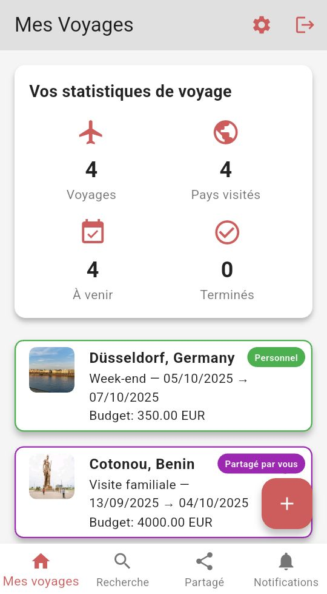

# Fonctionnalités détaillées d'Ifenia

Découvrez tout ce qu'Ifenia peut faire pour organiser vos voyages parfaitement.

## Écran principal - Mes Voyages

- **Tableau de bord statistique** : Visualisez d'un coup d'œil vos statistiques de voyage
  - Nombre total de voyages
  - Nombre de pays visités
  - Voyages à venir
  - Voyages terminés

- **Liste des voyages organisée** : Accédez facilement à tous vos voyages
  - Images représentatives des destinations
  - Étiquettes de statut (Personnel, Partagé par vous, Partagé avec vous)
  - Vue d'ensemble des informations principales (destination, dates, budget)

## Gestion collaborative

- **Partage de voyages** : Invitez famille et amis à collaborer sur vos plans de voyage
- **Contrôle des accès** : Définissez qui peut consulter ou modifier vos voyages
- **Listes partagées** : Découvrez et réutilisez des listes créées par d'autres voyageurs

## Suivi budgétaire

- **Budget par voyage** : Définissez un budget global pour chaque voyage
- **Suivi des dépenses** : Suivez vos dépenses réelles par rapport au budget prévu
- **Support multi-devises** : Gérez facilement différentes devises pour vos voyages internationaux

## Listes personnalisables

- **Listes prédéfinies** : Commencez rapidement avec des modèles comme "Indispensables" ou "À faire avant de partir"
- **Listes d'activités** : Découvrez et organisez les attractions à visiter
- **Organisation intuitive** : Créez vos propres catégories selon vos besoins

## Fonctionnalités supplémentaires

- **Mode sombre/clair** : Interface adaptée à toutes les conditions de luminosité
- **Support multilingue** : Disponible en français et en anglais
- **Notifications personnalisables** : Recevez des rappels pour vos voyages à venir et les activités des collaborateurs
- **Fonctionnement hors-ligne** : Accédez à vos informations même sans connexion internet

  
  
  

