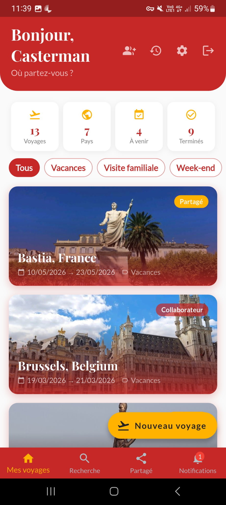
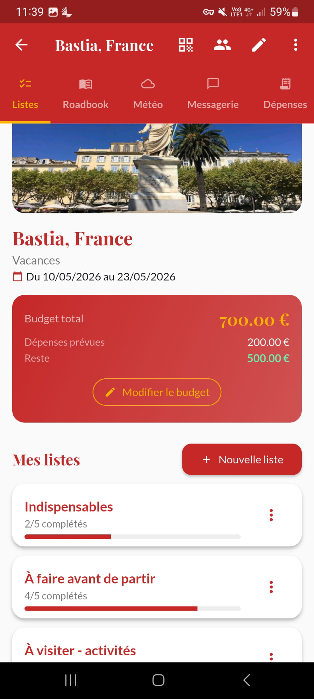
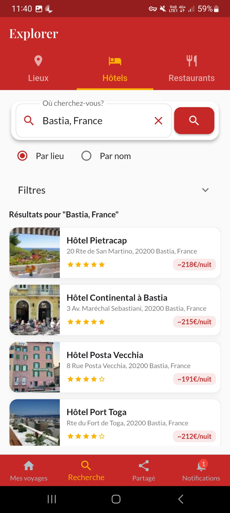
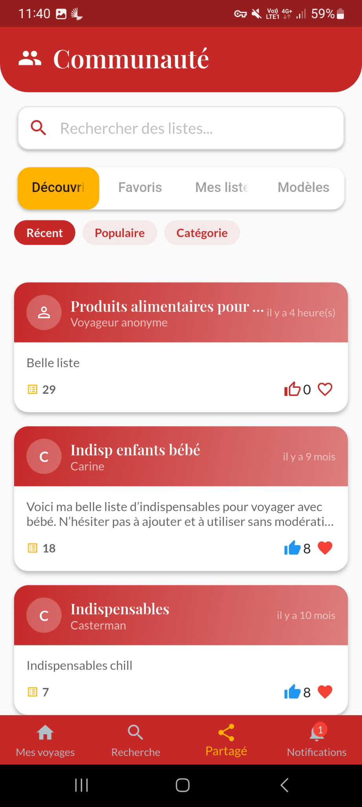
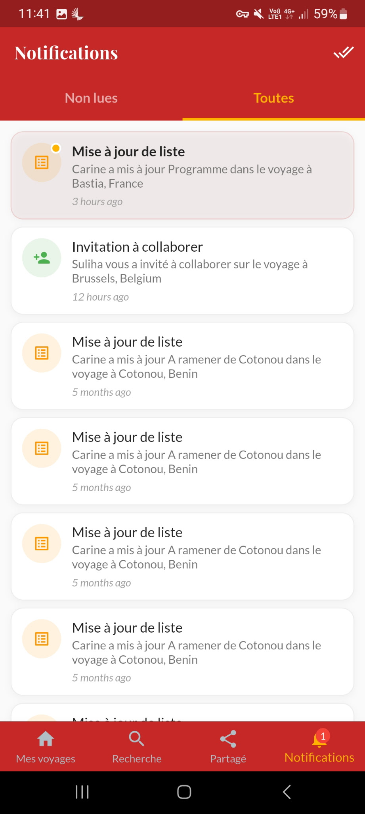
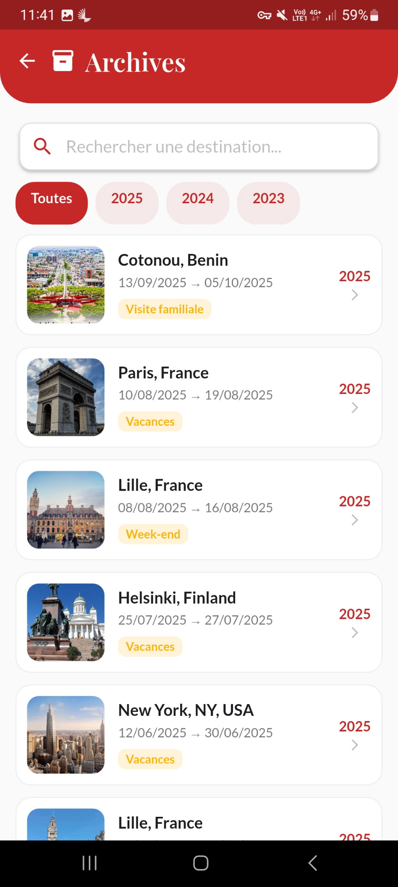

<!-- ═══ HERO ══════════════════════════════════════════════════ -->
<section class="hero">
  

    

      

        
        Disponible sur Google Play
      

      <h1 class="hero-title">
        Planifiez. 
        Partagez. 
        <em>Vivez.</em>
      </h1>

      

        L'application tout-en-un pour organiser vos voyages à plusieurs. Roadbook, dépenses partagées, météo, photos et bien plus — tout en temps réel, depuis votre mobile.
      

      

        <a href="https://play.google.com/store/apps/details?id=com.tangni.ifenia" class="btn btn--gold" target="_blank" rel="noopener">
          Télécharger gratuitement
        </a>
        <a href="features" class="btn btn--outline">
          Voir les fonctionnalités
        </a>
      

    

    

      

        
      

      

        
      

      

        
      

    

  

</section>

<!-- ═══ TRUST BAR ═════════════════════════════════════════════ -->

  

    
✅ 100 % gratuit

    

    
📱 Android &amp; iOS

    

    
🎨 10 thèmes de couleur

    

    
🔒 Données sécurisées Firebase

    

    
🌐 FR · EN

  

<!-- ═══ VALEUR AJOUTÉE ════════════════════════════════════════ -->
<section class="section section--ivory">
  

    

      
Pourquoi Ifenia ?

      <h2 class="headline headline--dark reveal">Une seule app. Tout ce qu'il faut.</h2>
      

      
Fini les onglets WhatsApp pour le budget, les Google Sheets pour les listes et les PDF perdus. Ifenia réunit tout au même endroit.

    

    

      

        
🗓️

        <h3>Organisation complète</h3>
        
Roadbook jour par jour, checklists personnalisables, météo intégrée sur 16 jours, export PDF de tout votre voyage en un tap.

      

      

        
👥

        <h3>Voyage à plusieurs, sans friction</h3>
        
Invitez vos compagnons en 2 secondes par QR code. Chat temps réel, dépenses partagées avec calcul automatique des soldes, sondages de groupe.

      

      

        
🧳

        <h3>Les outils du voyageur</h3>
        
Convertisseur de devises intégré, phrasebook en 8 langues, exploration Google Places (lieux, hôtels, restaurants) — tout pour voyager serein.

      

    

  

</section>

<!-- ═══ FEATURE ROW 1 — Roadbook ══════════════════════════════ -->
<section class="section--dark" style="border-top: 1px solid rgba(200,169,110,0.15);">
  

    

      
Roadbook &amp; Carte

      <h2>Votre itinéraire, organisé <em>à la perfection.</em></h2>
      

      
Le Roadbook unifie vos créneaux et vos items de listes datés en une vue chronologique claire. Chaque jour, visualisez d'un coup d'œil où vous allez et ce que vous faites.

      <ul class="feature-points">
        <li>Créneaux avec heure, lieu, type et description</li>
        <li>5 types : visite · restaurant · hôtel · transport · activité</li>
        <li>Carte Google Maps plein écran avec marqueurs colorés par type</li>
        <li>Export du roadbook complet dans le PDF du voyage</li>
      </ul>
    

    

      

        
      

    

  

</section>

<!-- ═══ FEATURE ROW 2 — Exploration ══════════════════════════ -->
<section class="section--ivory" style="border-top: 1px solid rgba(10,18,34,0.06);">
  

    

      
Exploration

      <h2>Explorez <em>avant même</em> de partir.</h2>
      

      
Recherchez des lieux, hôtels et restaurants directement dans l'app grâce à Google Places. Ajoutez vos coups de cœur à votre liste "À visiter" en un tap.

      <ul class="feature-points">
        <li>3 onglets : Lieux &amp; Attractions · Hôtels · Restaurants</li>
        <li>Top 10 résultats Google Places avec photos et ratings</li>
        <li>Filtrage par type de cuisine pour les restaurants</li>
        <li>Ajout direct à votre liste "À visiter"</li>
      </ul>
    

    

      

        
      

    

  

</section>

<!-- ═══ FEATURE ROW 3 — Communauté ═══════════════════════════ -->
<section class="section--dark" style="border-top: 1px solid rgba(200,169,110,0.15);">
  

    

      
Communauté

      <h2>Décidez ensemble. <em>Voyagez</em> ensemble.</h2>
      

      
Partagez vos listes avec la communauté, découvrez les itinéraires d'autres voyageurs, et importez-les directement dans votre voyage. Les sondages intégrés facilitent les décisions de groupe.

      <ul class="feature-points">
        <li>Partager une liste vers la communauté en un tap</li>
        <li>Découvrir : récentes · populaires · favoris</li>
        <li>Like, favori et import direct dans un voyage</li>
        <li>Sondages en temps réel avec barres de progression live</li>
      </ul>
    

    

      

        
      

    

  

</section>

<!-- ═══ COMMENT ÇA MARCHE ══════════════════════════════════════ -->
<section class="section section--ivory">
  

    

      
Simple &amp; rapide

      <h2 class="headline headline--dark reveal">Partez en 4 étapes.</h2>
      

    

    

      

        
1

        <h3>Créez votre voyage</h3>
        
Destination (Google Places), dates, budget, devise, catégorie et image de couverture.

      

      

        
2

        <h3>Invitez vos compagnons</h3>
        
Par QR code ou code 8 caractères — vos amis rejoignent le voyage en quelques secondes.

      

      

        
3

        <h3>Planifiez ensemble</h3>
        
Roadbook, checklists, dépenses, chat, sondages — tout se synchronise en temps réel.

      

      

        
4

        <h3>Vivez l'aventure</h3>
        
Météo, carte, album photo collaboratif — et exportez le tout en PDF à la fin.

      

    

  

</section>

<!-- ═══ MINI FEATURES GRID ════════════════════════════════════ -->
<section class="section section--white" style="border-top: 1px solid rgba(10,18,34,0.06);">
  

    

      
Et bien plus encore

      <h2 class="headline headline--dark reveal">Toutes les fonctionnalités dont vous avez besoin.</h2>
      

    

    

      

        ⛅
        

          <h4>Météo 16 jours</h4>
          
Prévisions quotidiennes Open-Meteo pour toute la période du voyage. Températures min/max et emojis météo.

        

      

      

        📸
        

          <h4>Album photo collaboratif</h4>
          
Grille 3 colonnes, upload compressé, affichage plein écran. Chaque collaborateur peut contribuer.

        

      

      

        💳
        

          <h4>Dépenses partagées</h4>
          
Saisissez les dépenses, définissez qui paie et la répartition. Soldes calculés automatiquement.

        

      

      

        📄
        

          <h4>Export PDF complet</h4>
          
Couverture, roadbook, listes et dépenses réunis en un seul document. Partagez ou imprimez.

        

      

      

        🗣️
        

          <h4>Phrasebook 8 langues</h4>
          
Phrases essentielles en 8 langues organisées par catégories. Utile partout dans le monde.

        

      

      

        💱
        

          <h4>Convertisseur de devises</h4>
          
Taux de change en temps réel. EUR, USD, GBP, XOF et bien d'autres — toujours à portée de main.

        

      

    

  

</section>

<!-- ═══ GALERIE DE SCREENSHOTS ════════════════════════════════ -->
<section class="section section--dark" style="border-top: 1px solid rgba(200,169,110,0.15);">
  

    

      
L'app en images

      <h2 class="headline reveal">Découvrez Ifenia.</h2>
      

    

    

      

        
      

      

        
      

      

        
      

      

        
      

      

        
      

    

  

</section>

<!-- ═══ DOWNLOAD CTA ═══════════════════════════════════════════ -->
<section class="download-section">
  
Gratuit · Sans publicité · Android &amp; iOS

  <h2 class="headline reveal" style="margin: 0.5rem auto 1rem;">Prêt pour votre prochain voyage ?</h2>
  

  
Téléchargez Ifenia et commencez à planifier votre prochaine aventure dès aujourd'hui.

  

    
    
  

</section>
