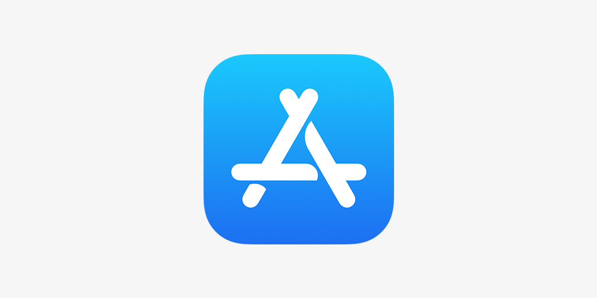

<!-- ═══════════════════════════════════════════════════════════
     HERO
═══════════════════════════════════════════════════════════ -->
<section class="hero">
  

    

    
Application mobile · iOS &amp; Android

    <h1 class="hero-title">
      L'art de voyager, <em>réinventé.</em>
    </h1>

    

      Planifiez, partagez et vivez chaque aventure avec une application mobile pensée pour les voyageurs exigeants.
    

    

      <a href="https://play.google.com/store/apps/details?id=com.tangni.ifenia" class="btn-primary" target="_blank" rel="noopener">
        Google Play
      </a>
      <a href="https://apps.apple.com/fr/app/ifenia/id6746134277" class="btn-secondary" target="_blank" rel="noopener">
        App Store
      </a>
    

  

  

    

    Découvrir
  

</section>

<!-- ═══════════════════════════════════════════════════════════
     STATS
═══════════════════════════════════════════════════════════ -->

  

    

      7
      Onglets par voyage
    

    

      7
      Thèmes de couleur
    

    

      4
      Devises supportées
    

    

      PDF
      Export natif inclus
    

  

<!-- ═══════════════════════════════════════════════════════════
     FONCTIONNALITÉS PRINCIPALES
═══════════════════════════════════════════════════════════ -->
<section class="section section--navy">
  

    

      
Fonctionnalités

      <h2 class="section-title">Tout ce dont vous avez besoin, au même endroit.</h2>
      

      
Ifenia centralise chaque aspect de votre voyage dans une interface élégante et intuitive.

    

    

      

        ✈️
        <h3>Gestion des voyages</h3>
        
Créez vos voyages avec autocomplétion Google Places, catégorie, dates, budget, devise et image. Partagez via QR code ou code d'invitation.

      

      

        👥
        <h3>Collaboration temps réel</h3>
        
Invitez famille et amis par email ou code. Chat intégré, rôles owner/éditeur, notifications push FCM automatiques à chaque modification.

      

      

        🗺️
        <h3>Roadbook &amp; Carte</h3>
        
Itinéraire unifié trié par jour et heure. Carte Google Maps plein écran avec marqueurs colorés par type de créneau et InfoWindow au tap.

      

      

        💳
        <h3>Finances partagées</h3>
        
Dépenses partagées avec répartition configurable. Calcul automatique des soldes — qui doit combien à qui — en multi-devises (EUR, USD, GBP, XOF).

      

      

        ⛅
        <h3>Météo intelligente</h3>
        
Prévisions quotidiennes Open-Meteo pour toute la période du voyage. Températures min/max, emojis WMO, 16 jours à l'avance ou archives.

      

      

        🌍
        <h3>Communauté</h3>
        
Partagez vos listes, découvrez les créations de la communauté, likez, mettez en favoris et importez directement dans vos voyages.

      

    

  

</section>

<!-- ═══════════════════════════════════════════════════════════
     7 ONGLETS DU DÉTAIL VOYAGE
═══════════════════════════════════════════════════════════ -->
<section class="section section--dark">
  

    

      
7 onglets intégrés

      <h2 class="section-title">Un voyage, une vision complète.</h2>
      

      
Chaque voyage dispose de sept onglets dédiés, pensés pour couvrir tous les aspects de votre séjour.

    

    

      

        <button class="tab-btn active" data-target="tab-listes">✓ Listes</button>
        <button class="tab-btn" data-target="tab-roadbook">🗺️ Roadbook</button>
        <button class="tab-btn" data-target="tab-meteo">⛅ Météo</button>
        <button class="tab-btn" data-target="tab-messages">💬 Messages</button>
        <button class="tab-btn" data-target="tab-depenses">💳 Dépenses</button>
        <button class="tab-btn" data-target="tab-photos">📸 Photos</button>
        <button class="tab-btn" data-target="tab-votes">🗳️ Votes</button>
      

      

        

          

            <h3>Listes &amp; Checklists</h3>
            
Organisez chaque détail avec des checklists personnalisables dotées de titres, états cochés, budgets et dates.

            <ul>
              <li>3 listes pré-créées à la création du voyage : Indispensables · À faire avant de partir · À visiter</li>
              <li>Activation budget par liste — suivi par item</li>
              <li>Métadonnées collaboratives : qui a modifié, quand</li>
              <li>Suggestions d'activités Google Places auto-ajoutées</li>
            </ul>
          

          

            ✅
          

        

        

          

            <h3>Roadbook</h3>
            
Vue unifiée de l'itinéraire et des items de listes datés, triés par jour puis par heure avec tags visuels distincts.

            <ul>
              <li>Ajout, édition et suppression de créneaux (heure, titre, type, lieu, description)</li>
              <li>5 types de créneaux : visite, restaurant, hôtel, transport, activité</li>
              <li>Bouton direct vers la carte Google Maps</li>
              <li>Vision jour par jour de l'aventure entière</li>
            </ul>
          

          

            🗺️
          

        

        

          

            <h3>Météo</h3>
            
Prévisions quotidiennes pour la destination, alimentées par Open-Meteo — gratuit et précis jusqu'à 16 jours.

            <ul>
              <li>Température minimale et maximale par jour</li>
              <li>Emoji météo WMO standardisés</li>
              <li>Support voyages passés (archives) et futurs</li>
              <li>Aucun abonnement requis — API gratuite</li>
            </ul>
          

          

            ⛅
          

        

        

          

            <h3>Messagerie</h3>
            
Chat en temps réel entre tous les collaborateurs du voyage, directement intégré dans l'application.

            <ul>
              <li>Messages instantanés via Firestore temps réel</li>
              <li>Historique complet de la conversation</li>
              <li>Nom de l'expéditeur affiché</li>
              <li>Isolé par voyage — pas de confusion entre projets</li>
            </ul>
          

          

            💬
          

        

        

          

            <h3>Dépenses</h3>
            
Gérez les finances du groupe : saisissez chaque dépense, définissez qui paie et comment répartir.

            <ul>
              <li>Montant, payeur et répartition entre participants</li>
              <li>Calcul automatique des soldes par personne</li>
              <li>Résumé clair : qui doit combien à qui</li>
              <li>Inclus dans l'export PDF du voyage</li>
            </ul>
          

          

            💳
          

        

        

          

            <h3>Album photos</h3>
            
Album collaboratif partagé entre tous les membres du voyage, accessible depuis l'application.

            <ul>
              <li>Grille 3 colonnes, upload compressé (70 %, 1000×1000 px)</li>
              <li>Affichage plein écran au tap</li>
              <li>Suppression par l'auteur ou le propriétaire du voyage</li>
              <li>Stockage sécurisé Firebase Storage</li>
            </ul>
          

          

            📸
          

        

        

          

            <h3>Sondages &amp; Votes</h3>
            
Prenez les décisions de groupe facilement avec des sondages interactifs en temps réel.

            <ul>
              <li>Création avec 2 à 4 options personnalisées</li>
              <li>Vote par simple tap — résultats instantanés</li>
              <li>Barres de progression live synchronisées</li>
              <li>Fermeture du sondage par le propriétaire du voyage</li>
            </ul>
          

          

            🗳️
          

        

      

    

  

</section>

<!-- ═══════════════════════════════════════════════════════════
     SCREENSHOTS
═══════════════════════════════════════════════════════════ -->
<section class="section section--navy">
  

    

      
Aperçu de l'application

      <h2 class="section-title">Conçu pour être beau, pensé pour être utile.</h2>
      

    

    

      

        

          
          
Mes Voyages

        

        

          
          
Détail &amp; Onglets

        

        

          
          
Finances &amp; Dépenses

        

      

    

  

</section>

<!-- ═══════════════════════════════════════════════════════════
     DOWNLOAD CTA
═══════════════════════════════════════════════════════════ -->
<section class="download-section">
  
Disponible maintenant

  <h2 class="section-title reveal">Prêt pour votre prochain voyage ?</h2>
  

  
Téléchargez Ifenia gratuitement et commencez à organiser votre prochaine aventure dès aujourd'hui.

  

    
    
  

</section>
